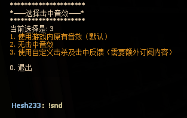

# 击中反馈分支

作者：TsukasaSato、Hesh233（分支）  
版本：1.1.5+

为玩家提供击中与击杀反馈，并允许每名玩家自行选择反馈声音。

## 游戏内指令

- `!snd`：选择命中反馈声音，选择结果会在离线后保留。

## 注意事项

- 普通感染者爆头时会播放击杀反馈。
- 自定义声音和图标位于 `addons/击杀及击中反馈.vpk`；插件不会自动把这些素材分发给玩家端。
- 玩家选择会保存在 `addons/sourcemod/data/SoundSelect.txt`。

